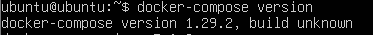
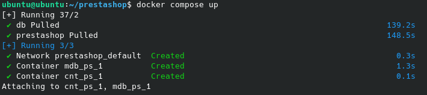
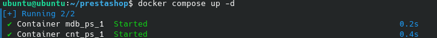
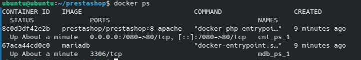
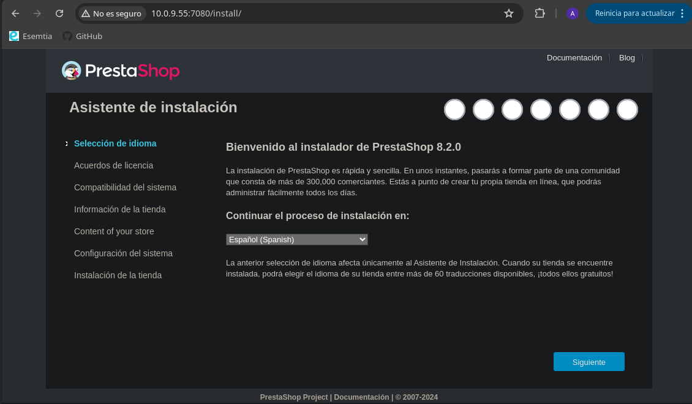
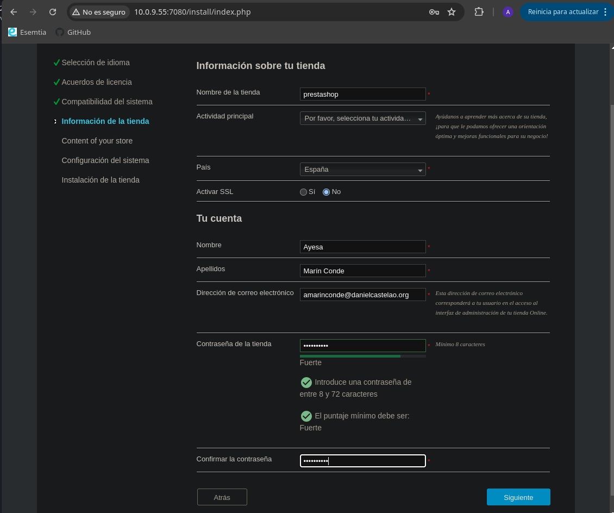
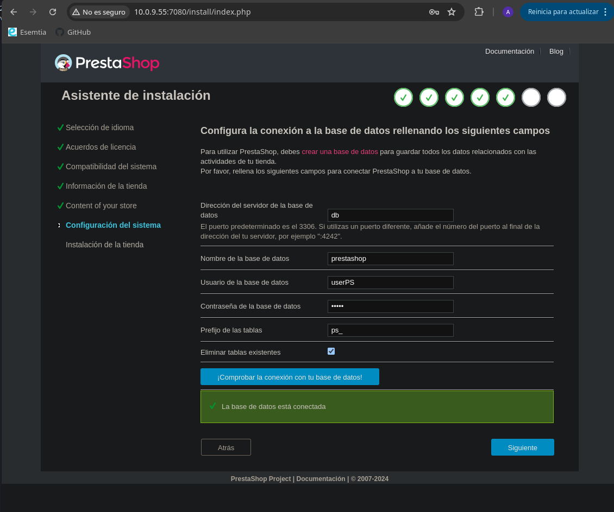
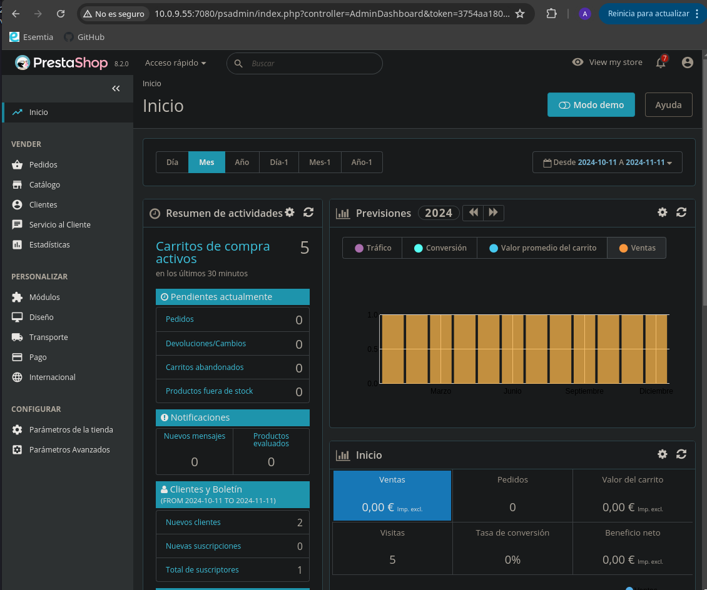

# Tarea 6

Pasos para la instalación de Prestashop con Docker Compose

## Instalación de Docker Compose

### 1. Descargar Docker Compose

```bash
sudo apt install docker-compose
```
### 2. Verificar la instalación

```bash
docker-compose --version
```


## Crear un archivo docker-compose.yml

### 1. Crear un archivo docker-compose.yml

```bash
mkdir prestashop
cd prestashop
nano docker-compose.yml
```
### 2. Agregar el siguiente contenido al archivo docker-compose.yml

```bash
services:

 db:
   image: mariadb                               # Especificación de version para la imagen de MariaDB
   container_name: mdb_ps_1                     # Definición de nombre del contenedor
   environment:
     MYSQL_ROOT_PASSWORD: admin                 # Contraseña del usuario root
     MYSQL_DATABASE: prestashop                 # Nombre de la base de datos 
     MYSQL_USER: userPS                         # Nombre de usuario de la base de datos 
     MYSQL_PASSWORD: pwdPS                      # Contraseña para el usuario

 prestashop:
   depends_on:
     - db                                       # Establecimiento de dependencia a la base de datos
   image: prestashop/prestashop:8-apache        # Especificación de version para la imagen de Prestashop
   container_name: cnt_ps_1                     # Definición de nombre del contenedor
   ports:
     - "7080:80"                                # Especificación de puerto para el servicio
   environment:
     DB_SERVER: db                              # Especificación de la base de datos a usar
```
## Contenedores

### 1. Crear los contenedores

```bash
docker-compose up
```


```bash
docker-compose up -d
```


### 2. Verificar los contenedores

```bash
docker ps
```


## Instalación Prestashop

### 1. Acceder a la dirección
```bash
http://localhost:7080
```


### 2. Configurar la instalación



### 3. Acceder al BackOffice y FrontOffice
```bash
# Eliminar la carpeta install 
docker exec -it cnt_ps_1 rm -rf /var/www/html/install

# Renombrar la carpeta admin
docker exec -it cnt_ps_1 mv /var/www/html/admin /var/www/html/psadmin
```

